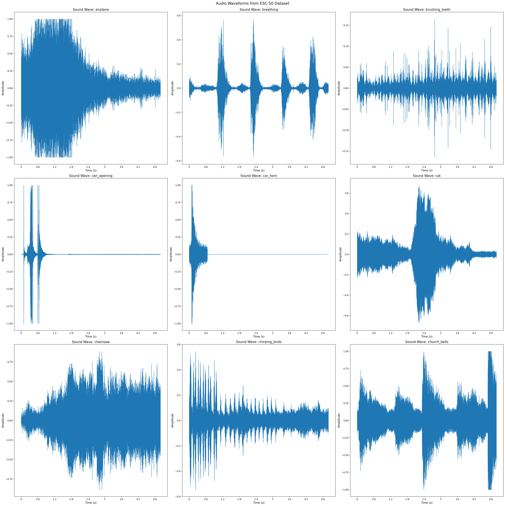
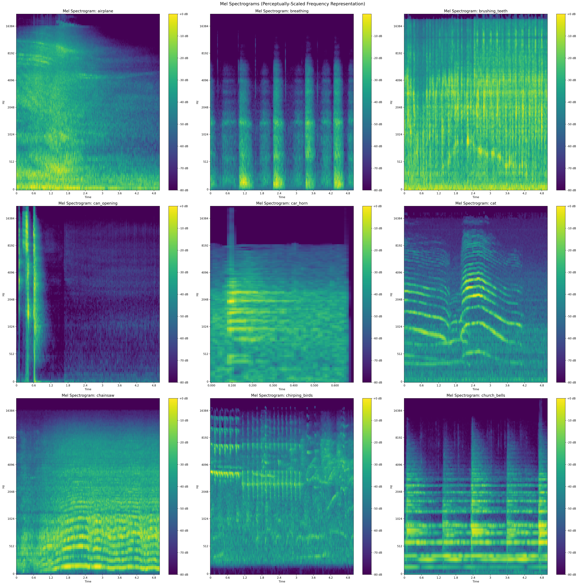

# ESC-50 Environmental Sound Classification Project

**ECEN 758 Data Mining and Analysis - Fall 2025**

**Team Members:**
- Banghyon Lee (Joseph)
- Fahimeh Orvati Nia
- Nandhini Valiveti
- Sushama Perati

## Project Overview

This project implements comprehensive environmental sound classification using the ESC-50 dataset. We explore traditional machine learning methods, deep learning approaches, and transfer learning techniques to classify 50 different environmental sound categories.

## Results Website

**Live Website:** [https://fahimehorvatinia.github.io/Group20-Data-Mining-Project/](https://fahimehorvatinia.github.io/Group20-Data-Mining-Project/)

The website includes interactive visualizations, model performance comparisons, and detailed results analysis.

## Dataset

**ESC-50 Dataset:**
- 2000 audio recordings (5 seconds each)
- 50 environmental sound classes
- 40 examples per class
- Pre-arranged into 5 folds for cross-validation

### Dataset Visualization

The dataset includes diverse environmental sounds across 5 categories:


*Sample audio waveforms from different sound classes*


*Mel spectrograms showing frequency content over time for different sound classes*


*3D PCA projection of features showing class separability (explained variance on each axis)*

## Features

### Feature Extraction

#### Traditional Features (176 features)
- **MFCC** (Mel-frequency cepstral coefficients): 20 features capturing spectral envelope
- **Chroma features**: 12 features representing pitch class information
- **Mel spectrogram**: 128 mel-scaled frequency bands
- **Spectral contrast**: 7 features capturing spectral peaks and valleys
- **Tonnetz**: 6 features representing tonal characteristics


*Spectrograms showing time-frequency representations of different sound classes*

#### Transfer Learning Features
- **YAMNet embeddings**: 2048 features per audio file (mean + std pooling of 1024-dim frame embeddings)
  - Pre-trained on AudioSet (2 million audio clips)
  - Captures high-level audio representations

### Preprocessing
- Raw features
- Normalized features (StandardScaler)
- Selected features (Top 100 via Mutual Information)

## Models Implemented

### Team Member Contributions

#### Fahimeh Orvati Nia
- Naive Bayes Classifier
- 1D Convolutional Neural Network (CNN)

#### Banghyon Lee (Joseph)
- Random Forest
- Gradient Boosting
- XGBoost
- Transfer Learning with YAMNet + Random Forest
- MLP on YAMNet embeddings
- Self-Supervised Learning (Pseudo-Labeling)

#### Nandhini Valiveti
- Support Vector Machine (SVM) - Linear kernel
- Support Vector Machine (SVM) - RBF kernel
- Multi-Layer Perceptron (MLP)

#### Sushama Perati
- Logistic Regression
- K-Nearest Neighbors (KNN)

## Evaluation Metrics

All models are evaluated using:
- Accuracy
- Precision (macro-averaged)
- Recall (macro-averaged)
- F1-Score (macro-averaged)
- Confusion Matrices
- Learning Curves
- Feature Importance (where applicable)

## Project Structure

```
.
├── ESC_50_Complete_Project_All_Methods.ipynb  # Main project notebook
├── Project_Report.tex                          # IEEE format report
├── results.html                                # Results visualization website
├── data_out/                                   # Feature files (CSV)
│   ├── esc50_features_raw.csv
│   ├── esc50_features_normalized_corrected.csv
│   └── esc50_features_selected.csv
├── ESC-50_data/                               # Dataset (audio files excluded from repo)
│   └── meta/                                   # Metadata only
└── README.md                                  # This file
```

## Getting Started

### Prerequisites

```bash
pip install numpy pandas scikit-learn matplotlib seaborn tensorflow tensorflow-hub librosa xgboost jupyter
```

### Running the Project

1. Clone this repository:
```bash
git clone https://github.com/fahimehorvatinia/Group20-Data-Mining-Project.git
cd Group20-Data-Mining-Project
```

2. Download the ESC-50 dataset from [here](https://github.com/karolpiczak/ESC-50) and extract to `ESC-50_data/`

3. Open and run `ESC_50_Complete_Project_All_Methods.ipynb` in Jupyter Notebook

4. View results in `results.html` (generated after running the notebook)

## Key Features

- Unified data splitting ensuring all classes in train/val/test
- No data leakage between splits
- Comprehensive model comparison
- Transfer learning with YAMNet
- Self-supervised learning exploration
- GPU/CPU compatibility

## Results Summary

### Top Performing Models

| Model | Dataset | Test Accuracy | Test F1 |
|-------|---------|--------------|---------|
| **YAMNet+RF (SSL, TH=0.90)** | YAMNet Embeddings | **83.75%** | 83.15% |
| **YAMNet + Random Forest** | YAMNet Embeddings | **83.44%** | 82.95% |
| **YAMNet+RF (SSL, TH=0.85)** | YAMNet Embeddings | **82.81%** | 82.24% |
| **YAMNet + MLP** | YAMNet Embeddings | **81.25%** | 80.55% |
| Random Forest | Normalized | 46.75% | 44.81% |
| XGBoost | Raw | 44.50% | 43.41% |
| CNN | Normalized | 38.25% | 36.50% |
| MLP | Normalized | 33.50% | 32.10% |

### Key Findings

- **Transfer Learning Dominance**: YAMNet embeddings achieve 83-84% test accuracy vs. 16-47% for traditional features, representing a **35+ percentage point improvement**
- **Best Traditional Model**: Random Forest achieves 46.8% accuracy on normalized features
- **Feature Preprocessing**: Normalization improves average accuracy from 28% to 31% for traditional classifiers
- **Self-Supervised Learning**: Pseudo-labeling provides 0.3-0.4% improvements over baseline YAMNet+RF

See the [Results Website](https://fahimehorvatinia.github.io/Group20-Data-Mining-Project/) for detailed performance comparisons across all models and feature sets.

## Report

The project report is available in `Project_Report.tex` (IEEE conference format).

## License

This project is for educational purposes as part of ECEN 758 Data Mining and Analysis course.

## Acknowledgments

- ESC-50 dataset creators
- TensorFlow Hub for YAMNet model
- scikit-learn, TensorFlow, and other open-source libraries

